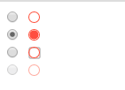

# CSS魔法堂：改变单选框颜色就这么吹毛求疵！

## 前言
&emsp;是否曾经被业务提出"能改改这个单选框的颜色吧！让它和主题颜色搭配一下吧！"，然后苦于原生不支持换颜色，最后被迫自己手撸一个凑合使用。若抛开`input[type=radio]`重新开发一个，发现要模拟选中、未选中、不可用等状态很繁琐，而涉及单选框组就更烦人了，其实我们可以通过`label`、`::before`、`:checked`和`tabindex`，然后外加少量JavaScript脚本就能很好地模拟出一个样式更丰富的“原生”单选框。下面我们一起来尝试吧！

## 单选框了解一下
&emsp;由于我们的目标是改变单选框颜色，其他外观特征和行为与原来的单选框一致，那么我们就必须先了解单选框原来的外观特征和行为主要有哪些。
1.外观特征
1.1.常态样式
```
margin: 3px 3px 0px 5px;
border: none 0;
padding: 0;
box-sizing: border-box;
display: inline-block;
line-height: normal;
position: static;
```
注意：外观上我们必须要保证布局特性和原生的一致，否则采用自定义单选框替换后很大机会会影响整体的布局，最后导致被迫调整其他元素的布局特性来达到整体的协调，从而扩大了修改范围。

1.2.获得焦点的样式
```
outline-offset: 0px;
outline: -webkit-focu-ring-color auto 5px;
```
注意：这里的获取焦点的样式仅通过键盘`Tab`键才生效，若通过鼠标点击虽然单选框已获得焦点，但上述样式并不会生效。

1.3.设置为`disabled`的样式
```
color: rgb(84, 84, 84);
```

2.行为特征
&emsp;单选框的行为特征，明显就是选中与否，及选中状态的改变事件，因此我们必须保持对外提供`change`事件。
&emsp;另外值得注意的是，当通过键盘的`Tab`键让单选框获得焦点后，再按下`Space`键则会选中该单选框。

&emsp;有了上述的了解，我们可以开始着手撸代码了！

## 少废话，撸代码

上图中左侧就是原生单选框，右侧为我们自定义的单选框。从上到下依次为*未选中*、*选中*、*获得焦点*和*disabled*状态的样式。

CSS部分
```
label.radio {
  /* 保证布局特性保持一致 */
  margin: 3px 3px 0px 5px;
  display: inline-block;
  box-sizing: border-box;

  width: 12px;
  height: 12px;
}

.radio__appearance{
  display: block; /* 设置为block则不受vertical-align影响，从而不会意外影响到.radio的linebox高度 */
  position: relative;
  box-shadow: 0 0 0 1px tomato; /* box-shadow不像border那样会影响盒子的框高 */
  border-radius: 50%;
  height: 90%;
  width: 90%;
  text-align: center;
}
label.radio [type=radio] + .radio__appearance::before{
  content: "";
  display: block;
  border-radius: 50%;
  width: 85%;
  height: 85%;

  position: absolute;
  top: 50%;
  left: 50%;
  transform: translate(-50%, -50%);

  transition: background .3s;
}
label.radio [type=radio]:checked + .radio__appearance::before{
  background: tomato;
}
label.radio [type=radio][disabled] + .radio__appearance{
  opacity: .5;
}
label.radio:focus{
  outline-offset: 0px;
  outline: #999 auto 5px;
}
/* 通过鼠标单击获得焦点时，outline效果不生效 */
label.radio.clicked{
  outline: none 0;
}
/* 自定义单选框的行为主要是基于原生单选框的，因此先将原生单选框隐藏 */
label.radio input {
  display: none;
}
```
HTML部分
```
<!-- 未选中状态 -->
<input type="radio">
<label class="radio" tabindex="0">
  <input type="radio" name="a">
  <i class="radio__appearance"></i>
</label>

<br>

<!-- 选中状态 -->
<input type="radio" checked>
<label class="radio" tabindex="0">
  <input type="radio" name="a" checked>
  <i class="radio__appearance"></i>
</label>

<br>

<!-- disabled状态 -->
<input type="radio" disabled>
  <label class="radio">
  <input type="radio" name="a" disabled>
  <i class="radio__appearance"></i>
</label>
```
JavaScript部分
```
var radios = document.querySelectorAll(".radio")
radios.forEach(radio => {
  // 模拟鼠标点击后:focus样式无效
  radio.addEventListener("mousedown", e => {
    var tar = e.currentTarget
    tar.classList.add("clicked")
    var fp = setInterval(function(){
      if (document.activeElement != tar){
        tar.classList.remove("clicked")
        clearInterval(fp)
      }
    }, 400)
  })
  // 模拟通过键盘获得焦点后，按`Space`键执行选中操作
  radio.addEventListener("keydown", e => {
    if (e.keyCode === 32){
      e.target.click()
    }
  })
})
```
这个实现有3个注意点：
1. 通过`label`传递鼠标点击事件到关联的`input[type=radio]`，因此可以安心隐藏单选框又可以利用单选框自身特性。但由于`label`控件自身的限制，如默认不是可获得焦点元素，因此无法传递键盘按键事件到单选框，即使添加`tabindex`特性也需手写JS来实现；
2. 当tabindex大于等于0时表示该元素可以获得焦点，为0时表示根据元素所在位置安排获得焦点的顺序，而大于0则表示越小越先获得焦点；
3. 由于单选框的`display`为`inline-block`，因此单选框将影响line box高度。当自定义单选框内元素采用`inline-block`时，若`vertical-align`设置稍有不慎就会导致内部元素所在的line box被撑高，从而导致自定义单选框所在的line box高度变大。因此这里采用将内部元素的`display`均设置为`block`的做法，直接让`vertical-align`失效，提高可控性。

## 总结
&emsp;对于复选框我们可以稍加修改就可以了，然后通过VUE、React等框架稍微封装一下提供更简约的API，使用起来就更方便了。
&emsp;尊重原创，转载请注明来自：^_^肥仔John
