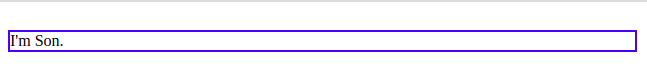

# CSS魔法堂：display:none与visibility:hidden的恩怨情仇

## 前言
&emsp;还记得面试时被问起"请说说display:none和visibility:hidden的区别"吗？是不是回答完`display:none`不占用原来的位置，而`visibility:hidden`保留原来的位置后，面试官就会心一笑呢？其实不止那么简单呢！本文我们将一起深究它俩的恩怨情仇，下次面试时我们可以回答得更出彩！

## 深入`display:none`
&emsp;我们都清楚当元素设置`display:none`后，界面上将不会显示该元素，并且该元素不占布局空间，但我们仍然可以通过JavaScript操作该元素。但为什么会这样呢？
&emsp;这个涉及到浏览器的渲染原理：浏览器会解析HTML标签生成DOM Tree，解析CSS生成CSSOM，然后将DOM Tree和CSSOM合成生成Render Tree，元素在Render Tree中对应0或多个盒子，然后浏览器以盒子模型的信息布局和渲染界面。而设置为`display:none`的元素则在Render Tree中没有生成对应的盒子模型，因此后续的布局、渲染工作自然没它什么事了，至于DOM操作还是可以的。
&emsp;但除了上面的知识点外，还有以下8个点我们需要注意的
1. 原生默认`display:none`的元素
其实浏览器原生元素中有不少自带`display:none`的元素，如`link`,`script`,`style`,`dialog`,`input[type=hidden]`等.

2. HTML5中新增hidden布尔属性，让开发者自定义元素的隐藏性
```
/* 兼容原生不支持hidden属性的浏览器  */
[hidden]{
  display: none;
}

<span hidden>Hide and Seek: You can't see me!</span>
```

3. 父元素为`display:none`，子孙元素也难逃一劫
```
.hidden{
  display: none;
}
.visible{
  display: block;
}

*** START ***
<div class="hidden">
  I'm parent!
  <div class="visible"> I'm son! </div>
</div>
*** END ***
```
浏览器直接显示为
```
*** START ***
*** END ***
```

4. 无法获取焦点
本来无一盒，何处惹焦点呢^_^即使通过tab键也是没办法的
```
<!-- 真心不会获得焦点 -->
<input type="hidden">
<div tabindex="1" style="display:none">hidden</div>
```

5. 无法响应任何事件，无论是捕获、命中目标和冒泡阶段均不可以
由于`display:none`的元素根本不会在界面上渲染，就是连1个像素的都不占，因此自然无法通过鼠标点击命中，而元素也无法获取焦点，那么也不能成为键盘事件的命中目标；而父元素的display为none时，子元素的display必定为none，因此元素也没有机会位于事件捕获或冒泡阶段的路径路径上，因此`display:none`的元素无法响应事件。

6. 不耽误form表单提交数据
虽然我们无法看到`display:none`的元素，但当表单提交时依然会将隐藏的input元素的值提交上去。
```
<form>
  <input type="hidden" name="id">
  <input type="text" name="gguid" style="display:none">
</form>
```

7. CSS中的counter会忽略`display:none`的元素
```
.start{
  counter-reset: son 0;
}
.son{
  counter-increment: son 1;
}
.son::before{
  content: counter(son) ". ";
}

<div class="start">
  <div class="son">son1</div>
  <div class="son" style="display:none">son2</div>
  <div class="son">son3</div>
</div>
```
结果就是：
```
1. son1
2. son3
```

8. Transition对`display`的变化不感冒
详情请参考[CSS魔法堂：Transition就这么好玩](https://www.cnblogs.com/fsjohnhuang/p/9143035.html)

9. display变化时将触发reflow
撇开`display:none`，我们看看`display:block`表示元素位于BFC中，而`display:inline`则表示元素位于IFC中，也就是说`display`的用于就是设置元素所属的布局上下文，若修改`display`值则表示元素采用的布局方式已发生变化，不触发reflow才奇怪呢！

## 深入`visibility`
&emsp;visibility有两个不同的作用
1. 用于隐藏表格的行和列
2. 用于在不触发布局的情况下隐藏元素

### 4个有效值
1. visible
&emsp;没什么好说的，就是在界面上显示。
2. hidden
&emsp;让元素在见面上不可视，但保留元素原来占有的位置。
3. collapse
&emsp;用于表格子元素(如`tr`,`tbody`,`col`,`colgroup`)时效果和`display:none`一样，用于其他元素上时则效果与`visibility:hidden`一样。不过由于各浏览器实现效果均有出入，因此一般不会使用这个值。
4. inherit
&emsp;继承父元素的`visibility`值。

## 对比清楚`display:none`和`visibility:hidden`
&emsp;上面我们已经对`display:none`列出8点注意事项，那么我们仅需对照它逐一列出`visibility`的不就清晰可见了吗？
1. 父元素为`visibility:hidden`，而子元素可以设置为`visibility:visible`并且生效
```
div{
  border: solid 2px blue;
}
.visible{
  visibility: visible;
}
.hidden{
  visibility: hidden;
}
<div class="hidden">
  I'm Parent.
  <div class="visible">
    I'm Son.
  </div>
</div>
```
结果：


2. 和`display:none`一样无法获得焦点

3. 可在冒泡阶段响应事件
由于设置为`visibility:hidden`的元素其子元素可以为`visibility:visible`，因此隐藏的元素有可能位于事件冒泡的路径上因此下面代码中，将鼠标移至`.visible`时，`.hidden`会响应`hover`事件显示。
```
div{
  border: solid 2px blue;
}
.visible{
  visibility: visible;
}
.hidden{
  visibility: hidden;
}
.hidden:hover{
  visibility: visible;
}
<div class="hidden">
  I'm Parent.
  <div class="visible">
    I'm Son.
  </div>
</div>
```

4. 和`display:none`一样不妨碍form表单的提交

5. CSS中的counter不会忽略

6. Transition对`visibility`的变化有效

7. visibility变化不会触发reflow
由于从visible设置为hidden时，不会改变元素布局相关的属性，因此不会触发reflow，只是静静地和其他渲染变化一起等待浏览器定时重绘界面。


## 总结
&emsp;现在我们对`display:none`和`visibility:hidden`应该有更深入的了解了，下次面试时我们的答案会更丰富出彩哦！
&emsp;尊重原创，转载请注意来自：肥仔John^_^

## 引用
https://css-tricks.com/almanac/properties/v/visibility/
https://juejin.im/post/5b406f40e51d45194832b759
