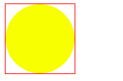
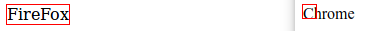

# CSS魔法堂：那个被我们忽略的outline

## 前言
&emsp;在[CSS魔法堂：改变单选框颜色就这么吹毛求疵！](https://www.cnblogs.com/fsjohnhuang/p/9741345.html)中我们要模拟原生单选框通过`Tab`键获得焦点的效果，这里涉及到一个常常被忽略的属性——`outline`，由于之前对其印象确实有些模糊，于是本文打算对其进行稍微深入的研究^_^

## Spec是这样描述它的
### 作用
&emsp;用于创建可视对象的轮廓(元素的border-box)，如表单按钮轮廓等。
### 与border不同
1. outline不占文档空间；
2. outline不一定是矩形。
### 具体属性说明
```
/* 轮廓线颜色 
 * invert表示为颜色反转，即使轮廓在不同的背景颜色中都可见 
 */
outline-color: invert | <color_name> | <hex_number> | <rgb_number> | inherit
/* 轮廓线样式 */
outline-style: none | dotted | dashed | solid | double | groove | ridge | inset | outset | inherit
/* 轮廓线宽度 */
outline-width: medium | thin | thick | <length> | inherit
/* 一次性设置轮廓线的颜色、样式 和 宽度 */
outline: <outline-color> <outline-style> <outline-width>;
/* 轮廓线的偏移量，大于0则轮廓扩大，小于0则轮廓缩小 */
outline-offset: 0px;
```

## 魔鬼在细节
### 兼容性
&emsp;`outline`作为CSS2.1规范，因此IE6/7/8(Q)均不支持，在IE8下写入正确的DOCTYPE则支持outline属性。
&emsp;`outline-offset`则IE下均不支持。
### IE6/7/8(Q)下隐藏outline
若要在IE6/7/8(Q)下隐藏outline效果，则在元素上添加`hideFocus`特性即可。
### `outline:0`和`outline:none`的区别
在Chrome下执行如下代码
```
<style type="text/css">
 .outline0{
   outline: 0;
 }
 .outline-none{
   outline: none;
 }
</style>
<a href="#" class="outline0">outline: 0</a>
<a href="#" class="outline-none">outline: none</a>
<script type="text/javascript">
  const $ = document.querySelector.bind(document)
  const print = console.log.bind(console)
  const cssProps = ["outline-width", "outline-style", "outline-color"]
  const slctrs = [".outline0", ".outline-none"]
     
  slctrs.forEach(slctr => {
    styles = window.getComputedStyle($(slctr))
      cssProps.forEach(cssProp => {
        print("%s, %s is %s", slctr, cssProp, styles[cssProp])
      })
    })
</script>
```
结果：
```
.outline0, outline-width is 0px
.outline0, outline-style is none
.outline0, outline-color is rgb(0, 0, 238)
.outline-none, outline-width is 0px
.outline-none, outline-style is none
.outline-none, outline-color is rgb(0, 0, 238)
```
&emsp;`outline`仅仅为设置单个或多个具体的`outline`属性提供更便捷的API而已，因此`outline:0`和`outline:none`本质上效果是一致的。
### 真心没法弄出圆角
&emsp;自从有了`border-radius`后，我们就可以通过CSS制作圆角矩形、圆形等图形，甚至连`box-shadow`也受到`border-radius`影响从而实现元素阴影也能做到圆角的效果。那么`outline`是否也能做出圆角的效果呢？答案是否定的。那是因为`outline`的作用本来就是用于勾勒出元素所占的空间轮廓，通过`border-radius`虽然实现了图形视觉上的圆角，但该元素所占位置空间一点都没有变化，还是那个有棱有角的方形。
```
<style type="text/css">
  .round{
    width: 100px;
    height: 100px;
    background: yellow;
    border-radius: 50%;
    outline: solid 1px red;
  }
</style>
```


### 轮廓的差异
&emsp;在Chrome下`outline`仅限于标识当前元素自身所占的位置空间（border-box），但在FireFox下则包含子孙元素所占的位置空间。
```
<style type="text/css">
  .outline{
    width: 13px;
    height: 13px;
    outline: 1px solid red;
  }
</style>
<div class="outline"></div>
<script type="text/javascript">
  const el = document.querySelector(".outline")
  el.textContent = !!~navigator.appVersion.indexOf("Chrome") ? "Chrome" : "FireFox"
</script>
```


## 总结
&emsp;尊重原创，转载请注明来自：^_^肥仔John

## 参考
https://www.xuebuyuan.com/757567.html
https://www.zhangxinxu.com/wordpress/2010/01/%E9%A1%B5%E9%9D%A2%E5%8F%AF%E7%94%A8%E6%80%A7%E4%B9%8Boutline%E8%BD%AE%E5%BB%93%E5%A4%96%E6%A1%86%E7%9A%84%E4%B8%80%E4%BA%9B%E7%A0%94%E7%A9%B6/
