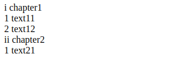
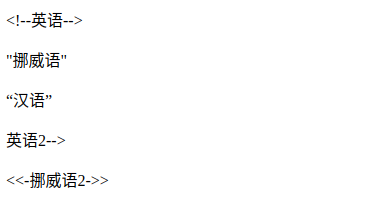

# CSS魔法堂：一起玩透伪元素和Content属性

## 前言
&emsp;继上篇《》记录完伪类后，我自然而然要向伪元素伸出“魔掌”的啦^_^。本文讲讲述伪元素以及功能强大的Contet属性，让我们可以通过伪元素更好地实现更多的可能！

## 初识伪元素
&emsp;说起伪元素我第一想到的莫过于`::before`和`::after`这两个了，它俩其实就是在其附属的选择器命中的元素上插入第一个子节点和追加最后一个子节点。那这时我不禁地想问：“直接添加两个class为.before和.after不是一样的吗？”
&emsp;其实使用伪元素`::before`和`::after`以下两个好处：
1. HTML的代码量减少，对SEO有帮助；
2. 提高JavaScript查询元素的效率。
&emsp;那为什么会这两好处呢？原因就是伪元素并不存在于DOM中，而是位于CSSOM，HTML代码和DOM Tree中均没有它的身影，量少了自然效率有所提升。但这也引入一个问题——我们没办法通过JavaScript完全操控伪元素（我将在下面一节为大家讲述）

### 一大波伪元素来了
除了`::before`和`::after`外，别漏了以下的哦！
1. `:first-line`：只能用于块级元素。用于设置附属元素的第一个行内容的样式。可用的CSS属性为`font,color,background,word-spacing,letter-spacing,text-decoration,vertical-align,text-transform,line-height,clear`。
2. `:first-letter`：只能用于块级元素。用于设置附属元素的第一个字母的样式。可用的CSS属性为`font,color,background,marin,padding,border,text-decoration,vertical-align,text-transform,line-height,float,clear`。
3. `::selection`：匹配选中部分的内容。可用的CSS属性为`background,color`。

有没有发现有的伪元素前缀是`:`有的却是`::`呢？`::`是CSS3的写法，其实除了`::selection`外，其他伪元素既两种前缀都是可以的，为兼容性可选择使用`:`，为容易区分伪元素和伪类则使用`::`，但我还是建议使用`::`来提高可读性，兼容性就让postcss等工具帮我们处理就好了。

### `::before`和`::after`的注意事项
1. 默认`display: inline`；
2. 必须设置content属性，否则一切都是无用功；
3. 默认`user-select: none`，就是`::before`和`::after`的内容无法被用户选中的；
4. 伪元素和伪类结合使用形如：`.target:hover::after`。

## JavaScript操作伪元素
&emsp;上文提到由于伪元素仅位于CSSOM中，因此我们仅能通过操作CSSOM API——`window.getComputedStyle`来读取伪元素的样式信息，注意：我们能做的就是读取，无法设置的哦！
```
{- window.getComputedStyle的类型 -}
data PseudoElement = ":before" | "::before" | ":after" | "::after" | ":first-line" | "::first-line" | ":first-letter" | "::first-letter" | "::selection" | ":backdrop" | "::backdrop" | Null

window.getComputedStyle :: HTMLElement -> PesudoElement -> CSSStyleDeclaration

{- CSSStyleDeclaration实例的方法 -}
data CSSPropertyName = "float" | "backround-color" | ......
data DOMPropertyName = "cssFloat" | "styleFloat" | "backgroundColor" | ......

-- IE9+的方法
CSSStyleDeclaration#getPropertyValue :: CSSPropertyName -> *
-- IE6~8的方法
CSSStyleDeclaration#getAttribute :: CSSPropertyName -> *
-- 键值对方式获取
CSSStyleDeclaration#[DOMPropertyName] -> *
```
示例：
```
.target[title="hello world"]::after{
  display: inline-block;
  content: attr(title);
  background: red;
  text-decoration: underline;
}

const elTarget = document.querySelector(".target")
const computedStyle = window.getComputedStyle(elTarget, "::after")
const content = computedStyle.getPropertyValue("content")
const bg = computedStyle.getAttribute("backgroundColor")
const txtDecoration = computedStyle["text-decoration"]

console.log(content) // "hello world"
console.log(bg)      // red
console.log(txtDecoration) // underline
```

## 玩透Content属性
&emsp;到这里我们已经可以利用`::before`和`::after`实现tooltip等效果了，但其实更为强大的且更需花时间研究的才刚要开始呢！那就是Content属性，不仅仅可以简单直接地设置一个字符串作为伪元素的内容，它还具备一定限度的编程能力，就如上面`attr(title)`那样，以其附属元素的title特性作为content值。下面请允许我为大家介绍吧！
```
div::after{
    content: "普通字符串";
    content: attr(父元素的html属性名称);
    content: url(图片、音频、视频等资源的url);
    /* 使用unicode字符集，采用4位16进制编码
     * 但不同的浏览器显示存在差异，而且移动端识别度更差
     */
    content: "\21e0";
    /* content的多个值可以任意组合，各部分通过空格分隔 */
    content: "'" attr(title) "'";
    
    /* 自增计数器，用于插入数字/字母/罗马数字编号
     * counter-reset: [<identifier> <integer>?]+，必选，用于标识自增计数器的作用范围，<identifier>为自定义名称，<integer>为起始编号默认为0。
     * counter-increment: [<identifier> <integer>?]+，用于标识计数器与实际关联的范围，<identifier>为counter-reset中的自定义名称，<integer>为步长默认为1。
     * <list-style-type>: disc | circle | square | decimal | decimal-leading-zero | lower-roman | upper-roman | lower-greek | lower-latin | upper-latin | armenian | georgian | lower-alpha | upper-alpha
     */
    content: counter(<identifier>, <list-style-type>);
    
    /* 以父附属元素的qutoes值作为content的值
     */
    content: open-quote | close-quote | no-open-quote | no-close-quote;
}
```
换行符：HTML实体为`&#010`，CSS为`\A`，JS为`\uA`。

&emsp;可以看到Content接受6种类型，和一种组合方式。其中最后两种比较复杂，我们后面逐一说明。

### 自定义计数器
&emsp;HTML为我们提供`ul`或`ol`和`li`来实现列表，但如果我们希望实现更为可性化的列表，那么该如何处理呢？content属性的counter类型值就能帮到我们。
```
<!-- HTML 部分-->
.dl
 .dt{chapter1}
 .dd{text11}
 .dd{text12}
 .dt{chapter2}
 .dd{text21}
 
/* CSS部分 */
.dl {
  counter-reset: dt 0; /* 表示解析到.dl时，重置dt计数器为0 */
  
  & .dt {
    counter-reset: dd 0; /* 表示解析到.dt时，重置dd计数器为0 */
    
    &::before{
        counter-increment: dt 1; /* 表示解析到.dt时，dt计数器自增1 */
        content: counter(dt, lower-roman) " ";
    }
  }
  
  & .dd::before {
    counter-increment: dd 1; /* 表示解析到.dd时，dd计数器自增1 */
    content: counter(dd) " ";
  }
}
```

通过`counter-reset`来定义和重置计数器，通过`counter-increment`来增加计数器的值，然后通过`counter`来决定使用哪个计数器，并指定使用哪种样式。
&emsp;如果用JavaScript来表示应该是这样的
```
const globalCounters = {"__temp":{}}

function resetCounter(name, value){
  globalCounters[name] = value
}
function incrementCounter(name, step){
  const oVal = globalCounters[name]
  if (oVal){
    globalCounters[name] = oVal + step
  }
  else{
    globalCounters.__temp[name] = step
  }
}
function counter(name, style){
    return globalCounters[name] || globalCounters.__temp[name]
}

function applyCSS(mount){
    const clz = mount.className
    if (clz == "dl"){
        resetCounter("dt", 0)
        const children = mount.children
        for (let i = 0; i < children.length; ++i){
          applyCSS(children[i])
        }
    }
    else if (clz == "dt"){
        resetCounter("dd", 0)
        incrementCounter("dt", 1)
        const elAsBefore = document.createElement("span")
        elAsBefore.textContent = counter("dt", "lower-roman") + " "
        mount.insertBefore(mount.firstChild)
    }
    else if (clz == "dd"){
        incrementCounter("dd", 1)
        const elAsBefore = document.createElement("span")
        elAsBefore.textContent = counter("dd", "lower-roman") + " "
        mount.insertBefore(mount.firstChild)
    }
}
```

#### 嵌套计数器
&emsp;对于多层嵌套计数器我们可以使用`counters(<identifier>, <separator>, <list-style-type>?)`
```html
.ol
  .li
    .ol
      .li{a}
      .li{b}
  .li
    .ol
      .li{c}
```
```css
.ol {
    counter-reset: ol;
    & .li::before {
        counter-increment: ol;
        content: counters(ol, ".");
    }
}
```


#### Content的限制
1. IE8+才支持Content属性；
2. 除了Opera9.5+中所有元素均支持外，其他浏览器仅能用于`:before,:after`内使用；
3. 无法通过JS获取Counter和Counters的运算结果。得到的就只能是`"counter(mycouonter) \" \""`。


### 自定义引号
&emsp;引号这个平时很少在意的符号，其实在不同的文化中使用的引号将不尽相同，如简体中文地区使用的`""`，而日本则使用`「」`。那我们根据需求自定义引号呢？答案是肯定的。
&emsp;通过`open-quote`,`close-quote`,`no-open-quote`和`no-close-quote`即可实现，下面我们通过例子来理解。
&emsp;`<q>`会根据父元素的`lang`属性自动创建`::before`和`::after`来实现插入quotation marks。
```html
p[lang=en]>q{英语}
p[lang=no]>q{挪威语}
p[lang=zh]>q{汉语}
p[lang=en]>q.no-quote{英语2}
div[lang=no]>.quote{挪威语2}
```
CSS片段：
```
p[lang=en] > q{
  quotes: "<!--" "-->"; /* 定义引号 */
}
p[lang=en] > q.no-quote::before{
  content: no-open-quote;
  /*或者 content: none;*/
}
div[lang=no] > .quote {
  quotes: "<<-" "->>";
}
div[lang=no] > .quote::before {
  content: open-quote;
}
div[lang=no] > .quote::after {
  content: close-quote;
}
```



## 示例
### 分割线
```html
p.sep{or}
```
```css
.sep {
  position: relative;
  text-align: center;
  
  &::before,
  &::after {
    content: "";
    box-sizing: border-box;
    height: 1px;
    width: 50%;
    border-left: 3em solid transparent;
    border-right: 3em solid transparent;
    position: absolute;
    top: 50%;
  }
  
  &::before {
    left: 0;
  }
  
  &::after {
    right: 0;
  }
}
```
### 只读效果(通过遮罩原来的元素实现)
```html
.input-group {
  position: relative;
  
  &.readonly::before {
    content: "";
    position: absolute;
    width: 100%;
    height: 100%;
    top: 0;
    left: 0;
  }
}
```
### 计数器
```html
.selections>input[type=checkbox]{option1}+input[type=checkbox]{option2}
.selection-count
```
```css
.selections{
  counter-reset: selection-count;
  
  & input:checked {
    counter-increment: selection-count;
  }
}
.selection-count::before {
  content: counter(selection-count);
}
```

## 最后
&emsp;尊重原创，转载请注明来自：肥仔John^_^

## 参考
http://www.wozhuye.com/compatible/297.html
https://dev.opera.com/articles/css-generated-content-techniques/
