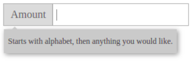

# CSS魔法堂：Transition就这么好玩

## 前言
&emsp;以前说起前端动画必须使用JS，而CSS3为我们带来transition和@keyframes，让我们可以以更简单（声明式代替命令式）和更高效的方式实现UI状态间的补间动画。本文为近期对Transition的学习总结，欢迎各位拍砖。

## 属性介绍
&emsp;首先先我们简单粗暴了解`transition`属性吧！
```
transition: <transition-property> <transition-duration> <transition-timing-function> <transition-delay>;

/* 设置启用Transition效果的CSS属性
 * 注意：仅会引发repaint或reflow的属性可启用Transition效果
 *       [CSS_animated_properties](https://developer.mozilla.org/en-US/docs/Web/CSS/CSS_animated_properties)
 */
<transition-property>: all | none | <property> [,<property>]*

/* 设置过渡动画持续时间，单位为s或ms
 */
<transition-duration>: 0s | <time> [, <time>]*

/* 设置过渡动画的缓动函数
 * cubic-bezier的值从0到1
 * [一个很好用的cubic-bezier配置工具](http://cubic-bezier.com)
 */
<transition-timing-function>: linear|ease|ease-in|ease-out|ease-in-out|cubic-bezier(n,n,n,n)

/* 设置过渡动画的延时，单位为s或ms
 */
<transition-delay>: 0s | <time> [, <time>]
```
&emsp;另外我们可以一次性为多个CSS属性启动Transition效果
```
transition: width 1s ease .6s,
            color .5s linear,
            background 2s ease-in-out;
```

## 触发方式
&emsp;既然Transition是UI状态间的补间动画，那么有且仅有修改UI状态时才能让动画动起来。那么就有3种方式了：
1. 伪类.`:link`,`:visited`,`:hover`,`:active`和`:focus`
2. 通过JS修改CSS属性值
3. 通过JS修改className值

## TransitionEnd事件详解
[TransitionEnd Event](https://developer.mozilla.org/en-US/docs/Web/Events/transitionend)
```
el.addEventListener("transitionend"
  , e => 
    {
      const pseudoElement = e.pseudoElement // 触发动画的伪类
          , propertyName = e.propertyName   // 发生动画的CSS属性
          , elapsedTime = e.elapsedTime     // 动画的持续时间
      // ..................
    })
```
注意：每个启用TransitionCSS属性的分别对应独立的`transitionend`事件
```
/* 触发3个transitionend事件 */
transition: width 1s ease .6s,
            color .5s linear,
            background 2s ease-in-out;
```

## Visibility也能transition？
&emsp;在可启用Transition的CSS属性中，我们发现到一个很特别的CSS属性——`visibility`。`visibility`常与`display`相提并论的属性，它凭什么能启用Transition，而`display`不行呢？这个我真心不清楚，不过我们还是了解启用transition的`visibility`先吧！
&emsp;`visibility`是离散值，0(`hidden`)表示隐藏，1(`visible`)表示完全显示，非0表示显示。那么`visibility`状态变化就存在两个方向的差异了：
1. 从**隐藏**到**显示**，由于非0就是显示，那么从值从0到1的过程中，实际上是从隐藏直接切换到显示的状态，因此并没有所谓的变化过程；
2. 从**显示**到**隐藏**，从1到0的过程中，存在一段时间保持在显示的状态，然后最后一瞬间切换到隐藏，因此效果上是变化延迟，依然没有变化过程。

&emsp;上述表明启用transition的`visibility`并没有补间动画的视觉效果，那么到底有什么作用呢？答案就是不影响/辅助其他CSS属性的补间动画。其中最明显的例子就是辅助`opacity`属性实现隐藏显示的补间动画。
```
<style>
.form-input{
	display: inline-flex;
	line-height: 2;
	border: solid 1px rgba(0,0,0,0.3);
}
.form-input:hover{
		border: solid 1px rgba(0,0,0,0.4);
}
.form-addon{
	font-style: normal;
	color: #666;
	background: #ddd;
	padding-left: 10px;
	padding-right: 10px;
	border-right: solid 1px rgba(0,0,0,0.3);
}
.form-addon-after{
	border-left: solid 1px rgba(0,0,0,0.3);
	border-right: none 0;
}
.form-control{
	border:none 0;
	outline-color: transparent;
	padding: 5px;
	caret-color: #888;
	font-size: 16px;
}
.tips-host{
	position: relative;
}
.tips{
	cursor: default;
	z-index: 999;
	position: absolute;
	top: 120%;
	font-size: 12px;
	color: #444;
	background: #ccc;
	padding: .5em;
	box-shadow: 2px 2px 10px #999;
	transition: box-shadow .2s,
		               opacity 1s,
		               visibility .8s;
	visibility: hidden;
	opacity: 0;
}
.tips:hover{
	box-shadow: 2px 2px 5px #999;
}
.tips::before{
	content: "";
	border: solid 10px transparent;
	border-bottom: solid 10px #ccc;
	position:  absolute;
	transform: translate(0, -100%);
}
.form-control:focus + .tips{
	visibility: visible;
	opacity: 1;
}
</style>
<div class="form-input tips-host" >
	<i class="form-addon">Amount</i>
	<input class="form-control">
	<div class="tips">
		Starts with alphabet, then anything you would like.
	</div>
</div>
```

&emsp;当`opacity:0`时，需要元素隐藏了但实际上它仍然位于原来的位置，而且可以拦截和响应鼠标事件，当出现元素重叠时则会导致底层元素失效。而由于`visibility:hidden`时，元素不显示且不拦截鼠标事件，所以在补间动画的最后设置`visibility:hidden`为不俗的解决办法。

## `display:none`让transition失效的补救措施
&emsp;虽然修改`display`有可能会引发reflow，但它依然不能启用Transition，这点真心要问问委员会了。更让人疑惑的是，它不单不支持启用Transition，而且当设置`display:none`时其余CSS属性的Transition均失效。难到这是让元素脱离渲染树的后果？？
```
<style>
.box{
  display: none;
  background: red;
  height: 20px;
}
</style>
<div class="box"></div>
<button id="btn1">Transition has no effect</button>
<button id="btn2">Transition takes effect</button>
<script>
const box = document.querySelector(".box")
    , btn1 = document.querySelector("#btn1")
    , btn2 = document.querySelector("#btn2")
btn1.addEventListener("click", e => {
  box.style.display = "block"
  box.style.background = "blue"
})
btn2.addEventListener("click", e => {
  box.style.display = "block"
  box.offsetWidth              // 强制执行reflow
  box.style.background = "blue"
})
</script>
```
上面的代码，当我们点击btn1时背景色的transition失效，而点击btn2则生效，关键区别就是通过`box.offsetWidth`强制执行reflow，让元素先加入渲染树进行渲染，然后再修改背景色执行repaint。
那么我们可以得到的补救措施就是——强制执行reflow，下面的操作均可强制执行reflow(注意：会影响性能哦！)
```
offsetWidth, offsetHeight, offsetTop, offsetLeft
scrollWidth, scrollHeight, scrollTop, scrollLeft
clientWidth, clientHeight, clientTop, clientLeft
getComputeStyle(), currentStyle()
```

## 总结

## 参考
[小tip: transition与visibility](http://www.zhangxinxu.com/wordpress/2013/05/transition-visibility-show-hide/)
https://www.cnblogs.com/surfaces/p/4324044.html
